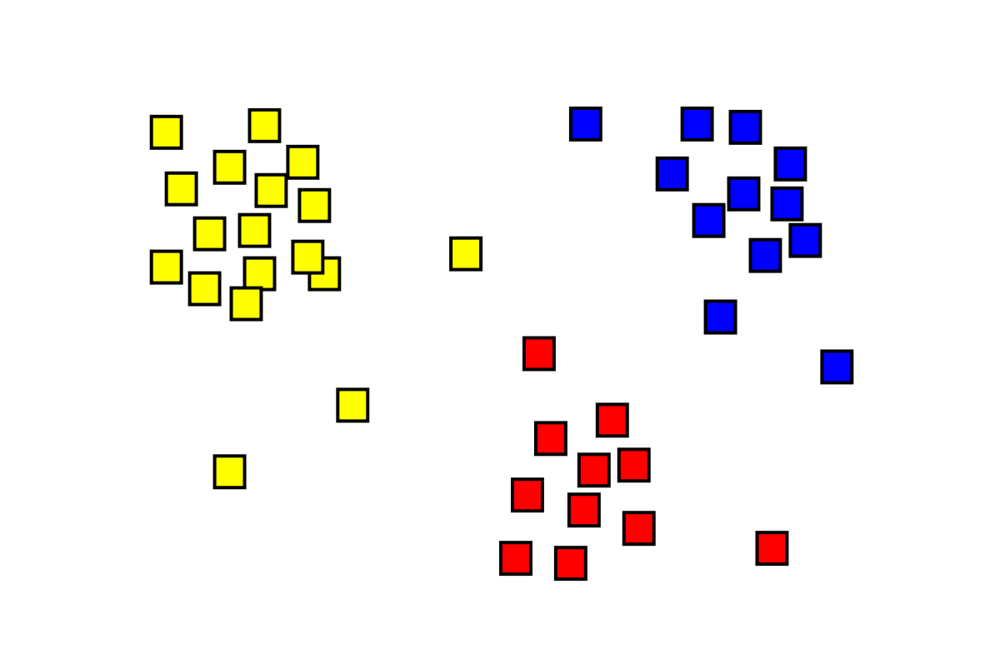

### What is img2vec?
The img2vec technique starts with extracting a feature vector per image in a dataset. The feature vector is a vector which contains a set of elements (features) that represents the image, its pixels and objects, in terms of for example colour, length, area, circularity, gradient magnitude, gradient direction, grey level, etc. The feature vector is a dense numerical representation of the input image, and it can be used for tasks such as comparing, ranking, classifying and clustering images. Once we have the image vector, we can treat it as we do words in word2vec models, to e.g find nearest neighbours in the embedding space, and to visualise relations between clusters/categories.

### Imagemonster

Imagemonster does img2vec analysis through feature extraction with Keras, and dimensionality reduction with either [scikit-learn tSNE](https://scikit-learn.org/stable/modules/generated/sklearn.manifold.TSNE.html), or [umap-learn](https://umap-learn.readthedocs.io/en/latest/index.html). It also supports 2d image plotting with [matplotlib](https://matplotlib.org/).

In deep learning, it is common practice to start with a model that has already been trained on a large dataset. The method used here uses [the ResNet50 or the Xception model](https://keras.io/api/applications/) in Keras, which were pre-trained on [ImageNet](http://www.image-net.org/). [Keras](https://keras.io/) is a deep learning API written in Python, running on top of the open-source machine learning platform [TensorFlow](https://www.tensorflow.org/). 
